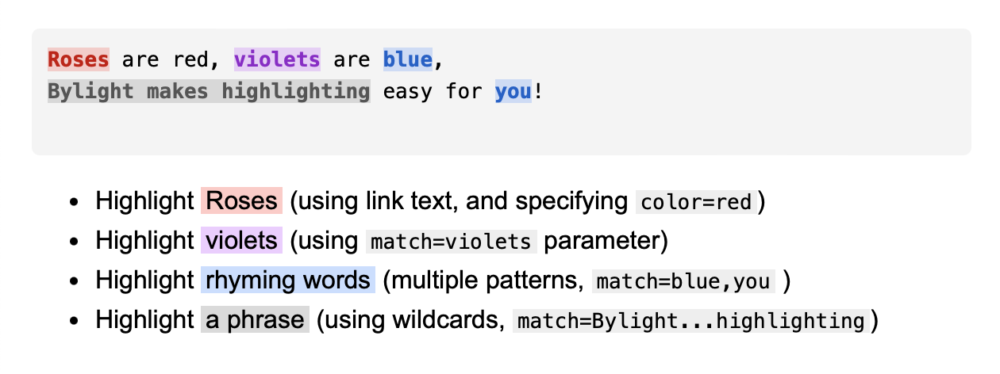

# Bylight

Bylight allows you to highlight code using special links in nearby text, making technical concepts more tangible when explaining code. See the [documentation and examples](https://mhuebert.github.io/bylight/).

## Features

- Highlight code snippets using special `bylight:` links
- Support for multiple highlighting patterns
- Regex pattern matching
- Directional highlighting (target specific code blocks)
- Customizable color scheme
- Easy integration with various JavaScript environments